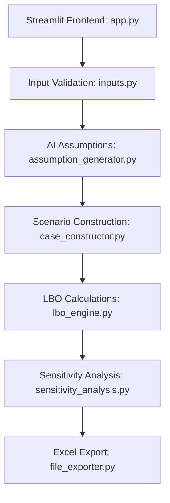

# AI-Assisted Leveraged Buyout (LBO) Modeling System

##  Overview
This project is an end-to-end AI-assisted Leveraged Buyout (LBO) modeling application that mirrors a real private-equity workflow. It combines user-provided financial data with AI-driven market intelligence to generate investment scenarios.

**The system features:**
* **User-provided deal facts:** Core financial inputs.
* **AI-generated financial assumptions:** Industry-specific benchmarks via LLM.
* **Deterministic LBO calculations:** Transparent, math-based engine.
* **Scenario analysis:** Automatic generation of Downside, Base, and Upside cases.
* **Sensitivity analysis:** Key driver tracking (IRR impact).
* **Excel export:** Downloadable models for offline analysis.
* **Interactive Frontend:** Built with Streamlit for a seamless UX.

---


##  Project Architecture



## Quick Start

Follow the steps below to run the project locally.

---

### 1. Clone the Repository

```bash
git clone https://github.com/manangupta28/AI-assisted-LBO
cd AI-assisted-LBO
```
### 2. Install dependencies 

```bash
pip install -r requirements.txt
```
### 3. Set up Environment Variables 
Create a .env file in the project root directory and add your Gemini API key
```bash
GEMINI_API_KEY=your_api_key_here
```
### 4. Run the application 
```bash
streamlit run app.py
```

## Possible Extensions 

* Monte Carlo simulation
* Advanced Capital Structures
* Cloud Deployment
* Scenario Comparison Dashboards

  


